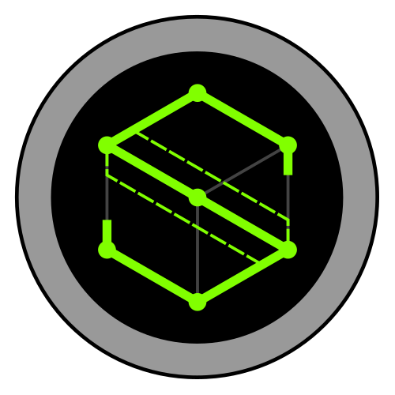
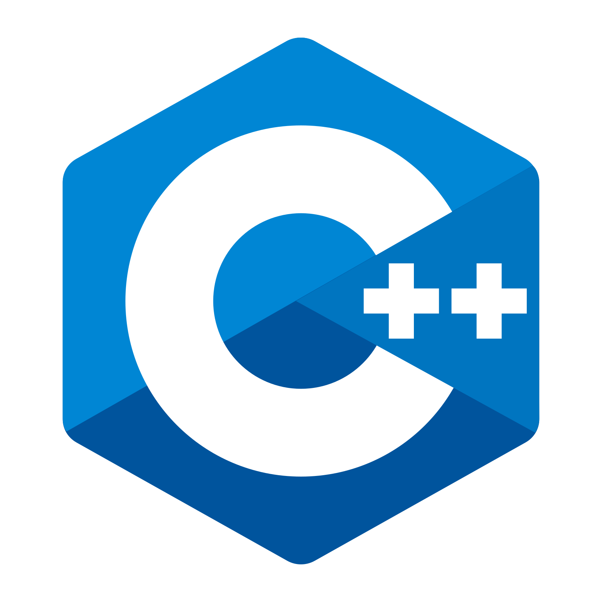
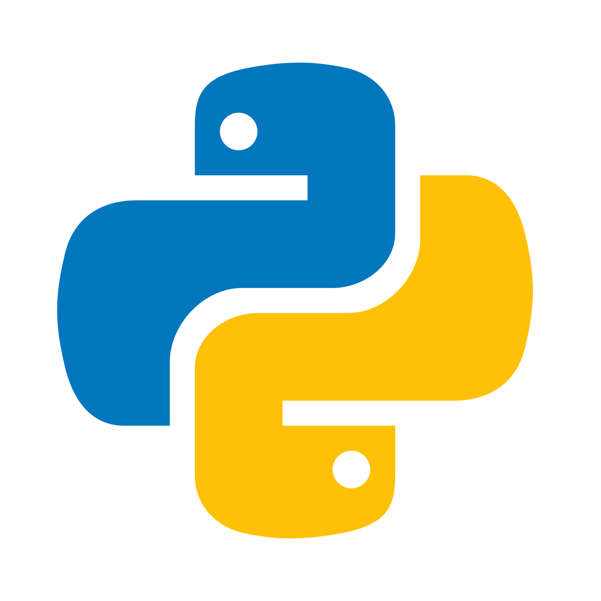
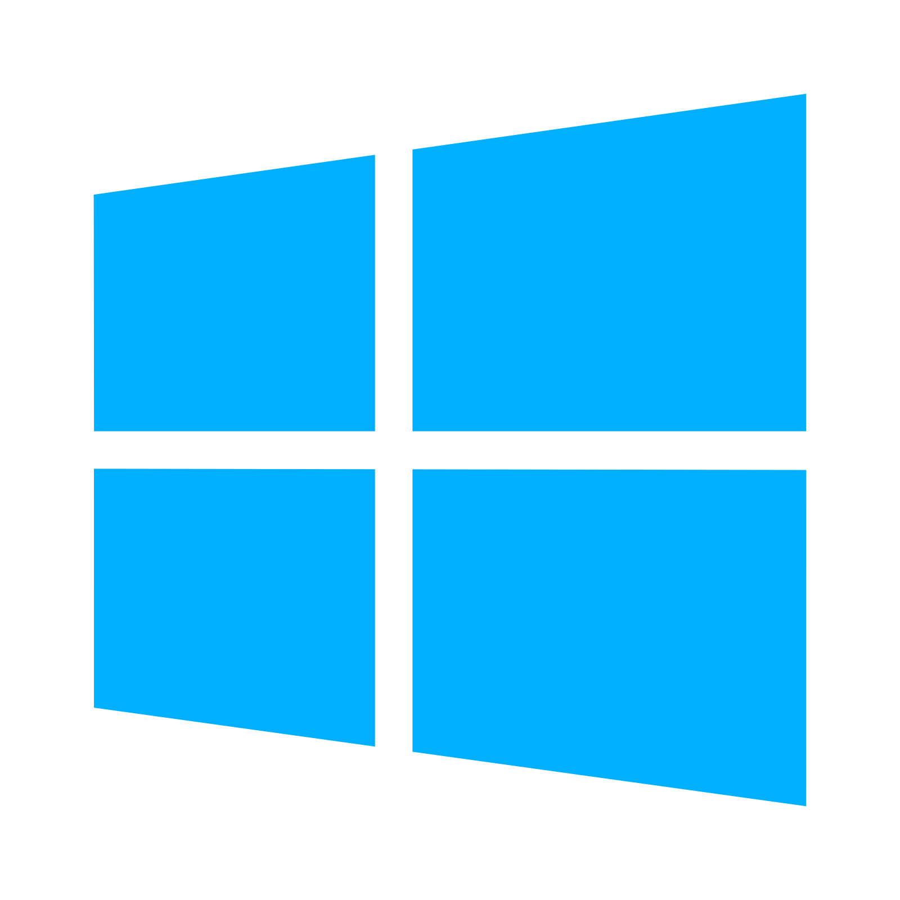

<table>
    <tr>
        <td></td>
        <td>
            

                <h1>
Sentinel Engine
</h1>
                <h2>
A WIP C++17 Game Engine
</h2>
                
                &nbsp;&nbsp;&nbsp;&nbsp;
                
                &nbsp;&nbsp;&nbsp;&nbsp;
                
                &nbsp;&nbsp;&nbsp;&nbsp;
                
                &nbsp;&nbsp;&nbsp;&nbsp;
                
            

        </td>
        <td>
             
             
             
             
            
        </td>
    </tr>
</table>
