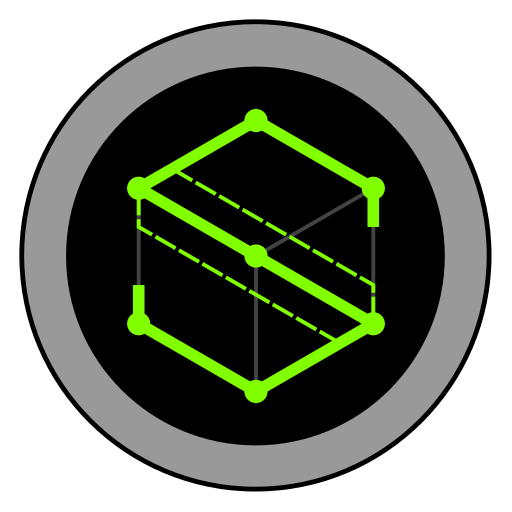

<table>
    <tr>
        <td></td>
        <td>
                <h1 align="center">Sentinel Engine</h1>
                <h3 align="center">A WIP C++17 Game Engine</h3>
                

                
                &nbsp;&nbsp;
                
                &nbsp;&nbsp;
                
                &nbsp;&nbsp;
                
                &nbsp;&nbsp;
                
                

        </td>
        <td>
             
             
             
             
            
        </td>
    </tr>
</table>

---

