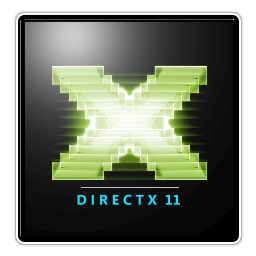

<table align="center">
    <tr>
        <td></td>
        <td>
                <h1 align="center">Sentinel</h1>
                <h3 align="center">C++14 Game Engine</h3>
                

                
                &nbsp;&nbsp;
                
                &nbsp;&nbsp;
                
                &nbsp;&nbsp;
                
                &nbsp;&nbsp;
                
                

        </td>
        <td>
             
             
             
             
            
        </td>
    </tr>
</table>

---

<h3>&nbsp;&nbsp;<ins>Description:</ins></h3>

Sentinel is a **C++14** based game engine, with **DirectX 11** currently as it's primary rendering API. Stemmed from the understandings and short comings of my previous work Ghost Engine, this engine is more focused on establishing a good architecture, proper editor-to-runtime pipeline, ease of use, and ultimately to develop the engine into something which can be used to actually make and ship small games instead of being another non-functional portfolio project/ defunct project.

Sentinel follows the Orthodox C++, or C-flavored C++ paradigm, where not a lot of modern C++ features are used, in order to make code as easy and straightforward to understand as possible.

---

<h3>&nbsp;&nbsp;<ins>Features:</ins></h3>

<table>
    <tr>
        <th>
Application
</th>
        <th>
Graphics
</th>
    </tr>
    <tr>
        <td>
            <ul>
                <li> Python + Premake build system setup</li>
                <li> Terminal logging, with printf-style formatting</li>
                <li> Multi-cast Event system</li>
                <li> Input polling</li>
                <li> Platform Agnostic Input codes</li>
                <li> SIMD/custom Math operations</li>
                <li> Basic ECS support using flecs</li>
                <li> Scene serialization/deserialization</li>
                <li> Archive I/O support</li>
                <li> File I/O and Filesystem operations </li>
            </ul>
        </td>
        <td>
            <ul>
                <li> Context and Swapchain creation</li>
                <li> Buffers (Vertex, Index, Constant)</li>
                <li> Shaders</li>
                <li> Textures</li>
                <li> Vertex Layouts using reflection</li>
                <li> Render-Textures and Depth-Textures</li>
                <li> Framebuffers</li>
                <li> General-purpose in-world camera</li>
            </ul>
        </td>
    </tr>
    <tr>
        <th>
Editor
</th>
        <th>
Ongoing
</th>
    </tr>
    <tr>
        <td>
            <ul>
                <li> Custom title-bar window</li>
                <li> ImGui Dockspace</li>
                <li> ImGui Viewport</li>
                <li> Scene Hierarchy Panel</li>
                <li> Device Information</li>
            </ul>
        </td>
        <td>
            <ul>
                <li> Development of scene rendering</li>
                <li> Archive-based data loading pipeline</li>
                <li> Resource loading from custom binary files</li>
                <li> More ECS components</li>
            </ul>
        </td>
    </tr>
</table>

---

<h3>&nbsp;&nbsp;<ins>Screenshots:</ins></h3>

---

<h3>&nbsp;&nbsp;<ins>Prerequisites:</ins></h3>

    :desktop_computer:<b>Hardware</b>
    <table>
        <tr>
            <td><b>Operating System</b></td>
            <td>Windows 10 or Windows 11</td>
        </tr>
        <tr>
            <td><b>Graphics Support</b></td>
            <td>DirectX 11 (Feature support 11_0 or above)</td>
        </tr>
    </table>

 

    :cd:<b>Software</b>
    <table>
        <tr>
            <td><b>Visual Studio 2022 or 2019</b></td>
            <td><a href="https://www.visualstudio.microsoft.com/vs/">Download Link</a></td>
            <td>Install <code>Desktop Development with C++</code> workload option</td>
        </tr>
        <tr>
            <td><b>Python 3.3 or higher</b></td>
            <td><a href="https://www.python.org/">Download Link</td>
            <td>Install <code>requests</code> package from <code>pip</code>
        </tr>
    </table>

---

<h3>&nbsp;&nbsp;<ins>Cloning:</ins></h3>

<ol>
    <li>
        

            Execute following git command in CLI to a local destination:
        

        <blockquote>
            <code>git clone https://github.com/CybernetHacker14/Sentinel.git</code>
        </blockquote>
    </li>
    <li>
        

            In the cloned folder, execute following git command in CLI:
        

        <blockquote>
            <code>git submodule update --init</code>
        </blockquote>
    </li>
</ol>
 
<ul>
    <li>
        

            Alternatively, execute following git command in CLI to a local destination:
        

        <blockquote>
            <code>git clone --recursive https://github.com/CybernetHacker14/Sentinel.git</code>
        </blockquote>
    </li>
</ul>

---

<h3>&nbsp;&nbsp;<ins>Project Creation:</ins></h3>

- **For Windows:** Execute the [`Setup.bat`](Scripts/Setup.bat) file present in the [`Scripts`](Scripts) folder and follow instructions.
This will create a new Visual Studio solution in the outermost directory.

<blockquote>
    :warning:&nbsp;&nbsp;
    Currently, only Premake option works. CMake build scripts aren't updated for latest changes
</blockquote>

---

<h3>&nbsp;&nbsp;<ins>Tech Stack:</ins></h3>

<table>
    <tr>
        <th>
Supported OS
</th>
        <th>
Supported IDEs
</th>
        <th>
Languages Used
</th>
    </tr>
    <tr>
        <td>
            <ul>
                <li> Windows 10</li>
                <li> Windows 11</li>
            </ul>
        </td>
        <td>
            <ul>
                <li> Visual Studio 2019</li>
                <li> Visual Studio 2022</li>
            </ul>
        </td>
        <td>
            <ul>
                <li> C++14 (Engine + Editor)</li>
                <li> HLSL (Shader language)</li>
                <li> Lua (Premake)</li>
                <li> CMake</li>
                <li> Python (Setup)</li>
            </ul>
        </td>
    </tr>
    <tr>
        <th colspan="3">
External Libraries
</th>
    </tr>
    <tr>
        <td><a href="https://github.com/CybernetHacker14/glfw/">glfw/GLFW</a></td>
        <td><a href="https://github.com/USCiLab/cereal/">USCiLab/cereal</a></td>
        <td><a href="https://github.com/SanderMertens/flecs">SanderMertens/flecs</a></td>
    </tr>
    <tr>
        <td><a href="https://github.com/ocornut/imgui">ocornut/imgui</a></td>
        <td><a href="https://github.com/zlib-ng/minizip-ng">zlib-ng/minizip-ng</a></td>
        <td><a href="https://github.com/nothings/stb/blob/master/stb_image.h">nothings/stb_image</a></td>
    </tr>
    <tr>
        <td><a href="https://github.com/Tessil/sparse-map">Tessil/sparse-map</a></td>
        <td><a href="https://github.com/g-truc/glm">g-truc/glm</a></td>
    </tr>
</table>
